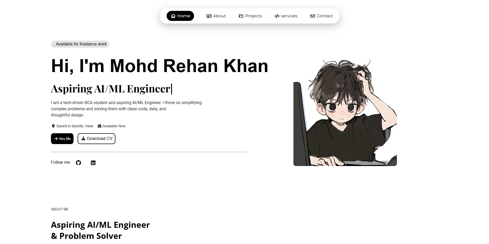

# 💼 Red_Khann Portfolio Website  

Welcome to **Mohd Rehan Khan’s Portfolio Website** — a sleek, interactive, and fully responsive portfolio built using **HTML, CSS, and JavaScript**.  
This project highlights my **skills, projects, and learning journey** as a **BCA student and aspiring AI/ML Engineer**.

---

## 🌐 Live Demo  
🔗 [View Portfolio](https://portfolio-website-v2-2r932zixx-mohd-rehan-khanns-projects.vercel.app/)

*(Hosted on Vercel — optimized for fast loading and responsive design.)*

---

## 🧩 How to Use / Customize  

### **Step 1 – Clone this repository**
```bash
git clone https://github.com/red-khann/Portfolio-website-v2.git
```

### **Step 2 – Open the project folder**
```bash
cd Portfolio-website-v2
```

### **Step 3 – Run the site locally**
```bash
# Option 1 – open index.html directly in your browser
# Option 2 – run with VS Code Live Server (extension recommended)
```

### **Step 4 – Customize content**
```bash
# Edit the following files to personalize your portfolio:
# index.html   -> update name, sections, and links
# stayle.css   -> change colors, fonts, and layout
# script.js    -> modify animations and interactivity
```

---

## ⚡ Key Features  
- 🎨 Modern black–blue UI  
- 📱 Fully responsive  
- 🔁 Smooth scroll navigation  
- 🧩 Animated cards and hover effects  
- 💬 Contact form with social links  
- ⚙️ Lightweight and fast  

---

## 🛠️ Technologies Used  

| Technology | Purpose |
|-------------|----------|
| **HTML5** | Structure and semantic layout |
| **CSS3** | Styling and responsiveness |
| **JavaScript (Vanilla JS)** | Interactivity and animations |
| **Font Awesome / Boxicons** | Icons |
| **AOS.js** | Scroll animations |
| **Vercel** | Deployment |

---

## 👨‍💻 About Me  
I’m **Mohd Rehan Khan**, a **BCA student at Maharaj Agrasen Mahavidyalaya** passionate about **AI, ML, and Data Science**.  
I love building data-driven projects that combine logic and creativity.

---

## 🪄 Future Enhancements  
- 🌙 Dark/Light mode  
- 🧠 AI/ML project gallery  
- 📩 EmailJS integration  
- 💬 Project filtering  

---

## 📬 Contact  
- 📧 **Email:** [rehan.khan786092.rk@gmail.com](mailto:rehan.khan786092.rk@gmail.com)  
- 📍 **Location:** [Bareilly, Uttar Pradesh, India](https://www.google.com/maps/place/Bareilly,+Uttar+Pradesh,+India) 
- 💼 **LinkedIn:** https://linkedin.com/in/mohd-rehan-khan-  
- 💻 **GitHub:** https://github.com/red-khann  

---

## 🧾 License  
Licensed under the **MIT License** — feel free to use and modify with credit.

---

### 🚀 Crafted with ❤️ by **Amine**, thoughtfully customized and enhanced by **Mohd Rehan Khan**.  
> “Blending creativity, logic, and passion to turn data into intelligent solutions.”


